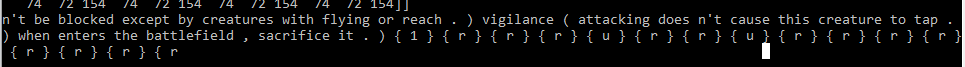

# Siguiendo con la bonita costumbre de buscar ideas para los proyectos finales del curso de Redes Neuronales del Dr. Julio Waissman y con la misma filosofía de capturar el estilo de las cosas utilizando redes neuronales, me surgio la duda de si podría generar texto através de una red neuronal recurrente (que son las mejores para estos casos segun alguna literatura que no recuerdo) y que dicho texto generado sea (por lo menos en esencia) coherente y válido para que sea jugado en el juego de cartas Magic: El Encuentro.      

# Resultados Paupérrimos ;(

## También se Generaron cadenas del estilo {t} {t} {t} {t} {t} {t} lo cual tiene un poco de sentido pues es el signo que indica girar una carta, que es una mecánica del juego pero el modelo no logra generar secuencias más variadas.

# Conclusiones 

* Se puede hacer una mayor limpieza del texto con el que se entreno la red.
* Las redes neuronales recurrentes son costosas de entrenar computacionalmente. Ciertamente falto tiempo de computo (por ejemplo mayor numero de epochs). Se entreno la red durante 6 horas aproximadamente, por lo general un buen entrenamiento de una rnn puede llegar a tardar cientos de horas.
* Los datos con los que fue entrenada la red no estan normalizados!!!!
* Se puede probar con distintas arquitecturas de red (por ejemplo una red mas profunda)
* Se pueden probar distintas formas de codificar las palabras del texto (bag of words, one-hot vector, etc).
* Se puede probar prediccion a nivel de carácter en lugar de a nivel palabra.

